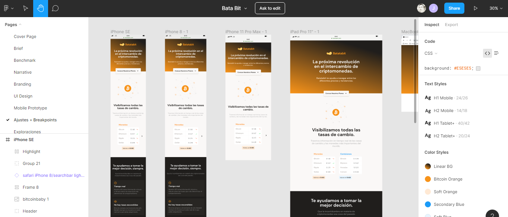

# Responsive Design Mobile First
# Figma como herramienta de diseño para luego codificar el layout.(Html5 - Css3 - Metodologia Bem )
# A modo personal me encanta comenzar con un diseño desde mobile para luego realizar la expansión a multidispositivos.

